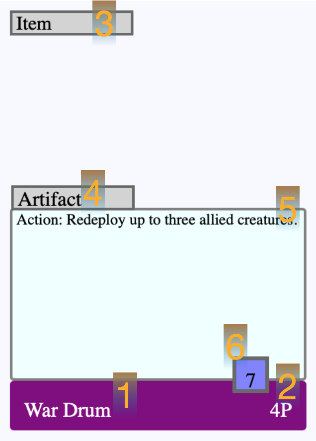

# DeckBuildWebsite

## How About Some Rules

### Contents
This is a game played with 40 cards, plus 5 additional Battlefields. In the 40 cards will be 6 Artifacts* (max of one copy each). The rest consists of Creatures and Instants (max of 4 copies per card name).

*Do we mean up to 6 or actually 6?
### Parts of a Card

#### Artifact

1. Name
2. Cost
3. Traits
4. Type ("Artifact" in this case)
5. Text block
6. Stats (only Health for Artifacts)

#### Creature

1. Name
2. Cost
3. Traits
4. Type ("Creature" in this case)
5. Text block
6. Stats (top to bottom: Power, Health, Restore**)

#### Instant

1. Name
2. Cost
3. Traits
4. Type ("Instant" in this case)
5. Text block

**Restore or Heal? Hopefully "Restore"
### Setting Up

You'll want a friend, your cards (40+5), a little space, and three kinds of small tokens. Plenty of them. Sitting across from your opponent (friend), you each separate your 5 Battlefields and place them facedown halfway between you and to your right. Shuffle the remaining 40 card deck until you are both satisfied and put that face down on your right. The first player is determined and they flip up the top battlefield from their stack, placing it in the Active Battlefield zone. You are now ready to begin the game.

1. Active Battlefield
2. Battlefield draw
3. Discard
4. Barracks (Creature play)
5. Artifact
6. Library (normal draw)
7. Recycled

### Playing the Game

The game is made up large rounds called *Phases* where each player takes *turns* playing actions and moving Creatures.

At the **Start of Phase**, if there is no Active Battlefield, the player who didn't bring the last Active Battlefield to the table reveals the top of their Battlefield deck.
Each player draws 3 cards from their library to their hand. They then discard up to 3 cards from their entire hand.

The player who brought the Active Battlefield goes first. They can summon creatures, take Actions, deploy, idle, etc. But only one of those things at a time. After the first player takes 1 action or passes, then the other player takes 1 action or passes. And so on and so forth until both players have consecutively passed their turns.

After both players have passed their turns back-to-back, no more actions can be taken. Everywhere there is at least one creature from each opponent in a zone, combat resolves simultaneously. If combat at the Active Battlefield leaves only creatures from one player surviving, then that player captures the battlefield and adds it to their Artifact Zone. All creatures return to their owner's barracks and ready. Cards recyled this round are shuffled among themselves and placed on the bottom of the library. This is the **End of Phase.**

### Winning The Game

The game ends the moment a player controls three Artifacts. Artifacts can only be built on controlled Battlefields so that's also a requirement.

---
rules still needed:
* combat
* global / controlled battlefield effects
* switch out battlefields
* summoning creatures / cost
* recyling
* idling (+ healing)
* guarding (+ healing)
* building artifacts
* deploying block / can't go past __ when __
* what the X | X | X syntax means, it stacks, permanent 

Keywords:
* subtle
* sturdy
* dauntless
* destroyed
* recycled
* discarded
* play
* deploy
* redeploy
* summon / resummon
* return to hand
